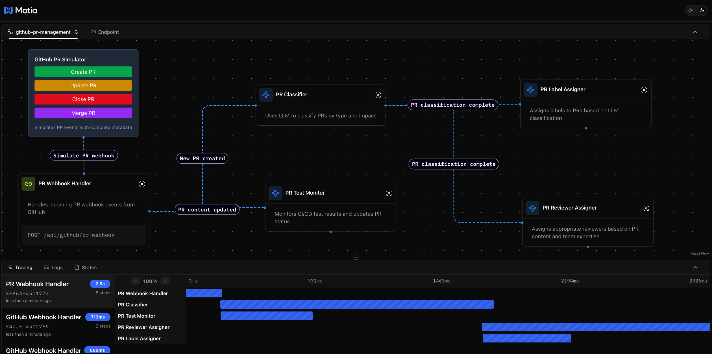

# Motia Examples 🚀

Welcome to the official examples repository for [Motia](https://motia.dev/) - the powerful agent development platform that helps you build, visualize, and deploy AI-powered agents with ease.

## What is Motia?

Motia is a modern agent development platform that enables you to:

- **Build versatile agents** - Connect APIs, databases, AI services, and custom logic in a visual interface
- **Create event-driven architectures** - Build reactive systems that respond to webhooks, scheduled tasks, and internal events
- **Leverage AI capabilities** - Integrate with LLMs and other AI services to build intelligent agents
- **Deploy with confidence** - Run your agents reliably in any environment with robust testing and monitoring

## 🗂 Examples

### GitHub Integration Agent

A comprehensive agent for automating GitHub issue and pull request management using AI-powered classification and routing.

**Key Features:**
- AI-powered issue and PR classification
- Automatic label assignment based on content
- Smart reviewer suggestions based on expertise
- Automatic movement between stages in the development lifecycle

**Technologies:** TypeScript, OpenAI, GitHub API

[View Example →](examples/github-integration-workflow)

### Gmail Account Manager

An intelligent Gmail agent that monitors, analyzes, and automatically responds to incoming emails.

**Key Features:**
- Email classification and urgency detection
- Automated responses based on content analysis
- Smart email organization
- Daily summaries via Discord

**Technologies:** TypeScript, Python, Google APIs, Discord, Hugging Face

[View Example →](examples/gmail-workflow)

### Trello Task Automation

Streamline development processes with an intelligent task progression agent for Trello boards.

**Key Features:**
- Automated card movement between lists
- Task validation and requirement checking
- AI-generated task summaries
- Slack integration for notifications

**Technologies:** TypeScript, Trello API, OpenAI, Slack

[View Example →](examples/trello-flow)

### Retrieval-Augmented Generation (RAG)

A complete RAG agent implementation for building knowledge-based AI applications.

**Key Features:**
- Web page content extraction and parsing
- Text chunking and embedding
- Vector database integration
- AI-powered question answering

**Technologies:** Python, TypeScript, FAISS, Google's Generative AI

[View Example →](examples/rag_example)

### AI Image Generation and Evaluation

An agent that generates and evaluates AI images with feedback loops and quality metrics.

  
  

**Key Features:**
- Prompt enhancement with AI
- Image generation with Flux
- Evaluation of generated images
- Dataset reports with quality metrics

**Technologies:** TypeScript, Python, Claude, Flux, OpenAI

[View Example →](examples/vision-example)

## 🚀 Getting Started

Each example includes its own README with detailed setup instructions. Generally, you'll need:

1. Clone this repository
2. Navigate to the example directory
3. Install dependencies
4. Configure environment variables
5. Run the agent with Motia

## 🤝 Contributing

We welcome contributions! If you've built an interesting agent with Motia, please share it by following our [contribution guidelines](CONTRIBUTING.md).

## 📝 License

This repository and its contents are licensed under the MIT License - see the [LICENSE](LICENSE) file for details.

## 📚 Learn More

- [Motia Documentation](https://motia.dev/docs)
- [API Reference](https://motia.dev/docs/api)
- [Tutorial Videos](https://motia.dev/resources)