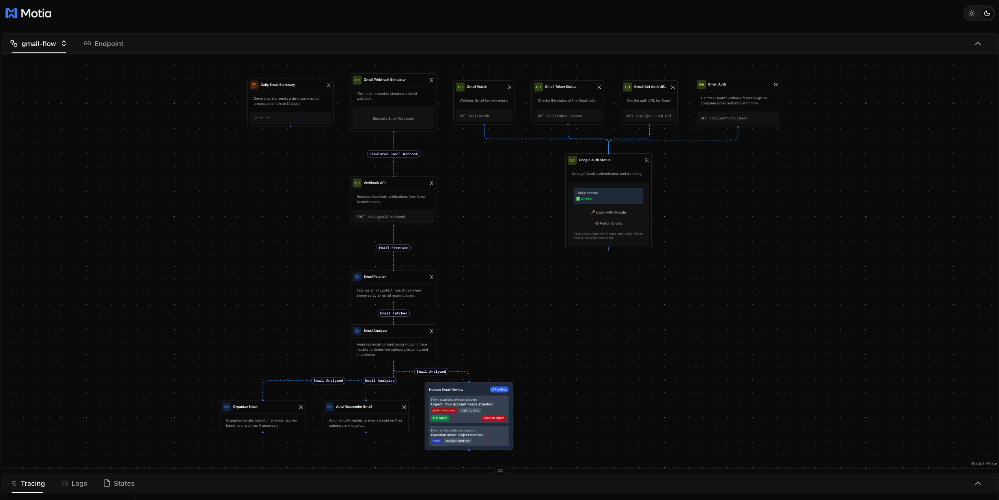
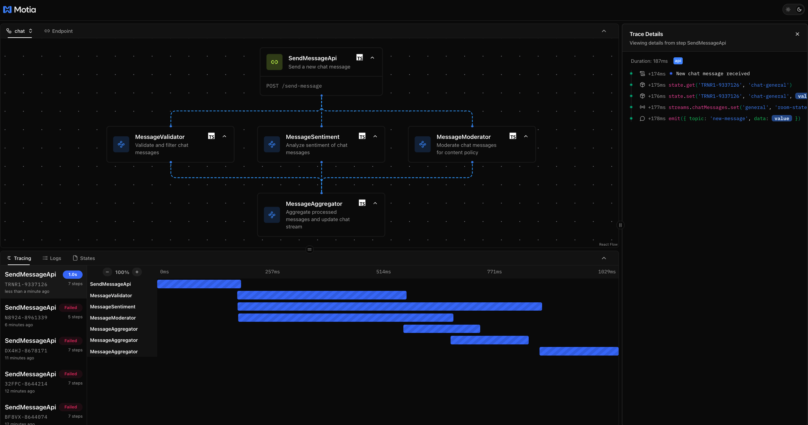

# Motia Examples 🚀

Welcome to the official examples repository for [Motia](https://motia.dev/) - a modern backend framework for building event-driven applications with built-in observability and state management.

## 🤔 How it Works

Motia uses **Steps** as its core building block. Steps can be:
- **API Steps** (`api`) - HTTP endpoints for REST/GraphQL APIs
- **Event Steps** (`event`) - Background workers triggered by events
- **Cron Steps** (`cron`) - Scheduled tasks that run automatically

Each Step has access to:
- **State Management** - Traced key-value store shared across steps
- **Event System** - Emit and subscribe to decouple your logic
- **Observability** - Built-in tracing and structured logging

A single Motia app can replace multiple tools like Nest.js, Temporal, and Celery/BullMQ - it's all just steps and events.

## 🗂 Examples

### AI Deep Research Agent

A powerful research assistant that performs comprehensive web research on any topic or question, providing in-depth analysis and reports.

**Key Features:**
- Deep Web Research: Searches the web, extracts content, and synthesizes findings
- Iterative Research Process: Supports multiple research depths for comprehensive exploration
- API Endpoints: REST API for initiating research and retrieving reports
- Parallel Processing: Efficiently processes search results and content extraction

**Technologies:** TypeScript, OpenAI, Firecrawl API

[View Example →](examples/ai-deep-research-agent)

### Finance Agent

A powerful event-driven financial analysis workflow built with Motia that combines web search, financial data, and AI analysis to provide comprehensive investment insights.

**Key Features:**
- Real-time Financial Analysis: Combines multiple data sources for comprehensive insights
- AI-Powered Insights: Leverages OpenAI GPT-4 for intelligent market analysis
- Web Search Integration: Aggregates latest market news and analysis
- Financial Data Integration: Real-time stock and company information

**Technologies:** TypeScript, Alpha Vantage API, SerperDev, OpenAI

[View Example →](examples/finance-agent)

### GitHub Integration Agent

A comprehensive agent for automating GitHub issue and pull request management using AI-powered classification and routing.

  
  

**Key Features:**
- AI-powered issue and PR classification
- Automatic label assignment based on content
- Smart reviewer suggestions based on expertise
- Automatic movement between stages in the development lifecycle

**Technologies:** TypeScript, OpenAI, GitHub API

[View Example →](examples/github-integration-workflow)

### Gmail Account Manager

An intelligent Gmail agent that monitors, analyzes, and automatically responds to incoming emails.

**Key Features:**
- Email classification and urgency detection
- Automated responses based on content analysis
- Smart email organization
- Daily summaries via Discord

**Technologies:** TypeScript, Python, Google APIs, Discord, Hugging Face

[View Example →](examples/gmail-workflow)

### Trello Task Automation

Streamline development processes with an intelligent task progression agent for Trello boards.

**Key Features:**
- Automated card movement between lists
- Task validation and requirement checking
- AI-generated task summaries
- Slack integration for notifications

**Technologies:** TypeScript, Trello API, OpenAI, Slack

[View Example →](examples/trello-flow)

### Retrieval-Augmented Generation (RAG)

A complete RAG agent implementation for building knowledge-based AI applications.

**Key Features:**
- Web page content extraction and parsing
- Text chunking and embedding
- Vector database integration
- AI-powered question answering

**Technologies:** Python, TypeScript, FAISS, Google's Generative AI

[View Example →](examples/rag_example)

### AI Image Generation and Evaluation

An agent that generates and evaluates AI images with feedback loops and quality metrics.

  
  

**Key Features:**
- Prompt enhancement with AI
- Image generation with Flux
- Evaluation of generated images
- Dataset reports with quality metrics

**Technologies:** TypeScript, Python, Claude, Flux, OpenAI

[View Example →](examples/vision-example)

### PDF RAG Agent using Motia, Docling and Weaviate

An LLM chat-like question-answering system with RAG (Retrieval-Augmented Generation) to provide accurate answers from PDF documents.
The system leverages Docling to parse and intelligently chunk PDF documents, Weaviate as a vector database to store vectorized chunks, and OpenAI for embeddings and text generation.

  

**Key Features:**
- PDF document processing and chunking
- Vector storage using Weaviate
- Docling for PDF parsing and hybrid chunking
- OpenAI integration for embeddings and text generation
- Question answering using RAG pattern

**Technologies:** TypeScript, Python, Docling, Weaviate, OpenAI

[View Example →](examples/rag-docling-weaviate-agent)

### Real-Time Chat Application

A comprehensive demonstration of real-time chat functionality with asynchronous message processing using the Motia Framework.

**Key Features:**
- Real-time messaging with WebSocket streaming
- Concurrent message processing (validation, sentiment analysis, moderation)
- Event-driven architecture with pub/sub messaging
- Type-safe message handling with Zod validation
- Live chat state updates and message aggregation

**Technologies:** TypeScript, Motia Streams, Event System

[View Example →](examples/chat-agent)

### Real time Chat Implementation

A real-time chat agent implementation showcasing interactive conversational capabilities.

  

**Key Features:**
- Real-time chat interactions
- Natural language processing
- Context-aware responses
- Customizable conversation flows

**Technologies:** TypeScript, OpenAI

[View Example →](examples/chat-agent)

### Motia Parallel Execution

A demonstration of parallel task execution capabilities in Motia agents.

  

**Key Features:**
- Concurrent task processing
- Workload distribution
- Performance optimization
- Resource management

**Technologies:** TypeScript

[View Example →](examples/motia-parallel-execution)

### Research Assistant

An intelligent research assistant that helps gather and analyze information.

  

**Key Features:**
- Information gathering
- Data analysis
- Research synthesis
- Citation management

**Technologies:** TypeScript, OpenAI

[View Example →](examples/research-assistant)

### Streaming AI Chatbot

A real-time streaming chatbot implementation with AI capabilities.

  

**Key Features:**
- Real-time message streaming
- Interactive responses
- Token-by-token output
- WebSocket integration

**Technologies:** TypeScript, OpenAI Streaming

[View Example →](examples/streaming-ai-chatbot)

### Conversation Analyzer with Vision

An advanced agent that analyzes conversations with both text and visual understanding capabilities.

  

**Key Features:**
- Multi-modal conversation analysis
- Visual content processing
- Sentiment analysis
- Contextual understanding

**Technologies:** TypeScript, OpenAI Vision, Natural Language Processing

[View Example →](examples/conversation-analyzer-with-vision)

## 🚀 Getting Started

Each example includes its own README with detailed setup instructions. Generally, you'll need:

1. Clone this repository
2. Navigate to the example directory
3. Install dependencies
4. Configure environment variables
5. Run the agent with Motia

## 🤝 Contributing

We welcome contributions! If you've built an interesting agent with Motia, please share it by following our [contribution guidelines](CONTRIBUTING.md).

## 📝 License

This repository and its contents are licensed under the MIT License - see the [LICENSE](LICENSE) file for details.

## 📚 Learn More

- [Motia Documentation](https://motia.dev/docs)
- [Motia Tutorials](https://blog.motia.dev)